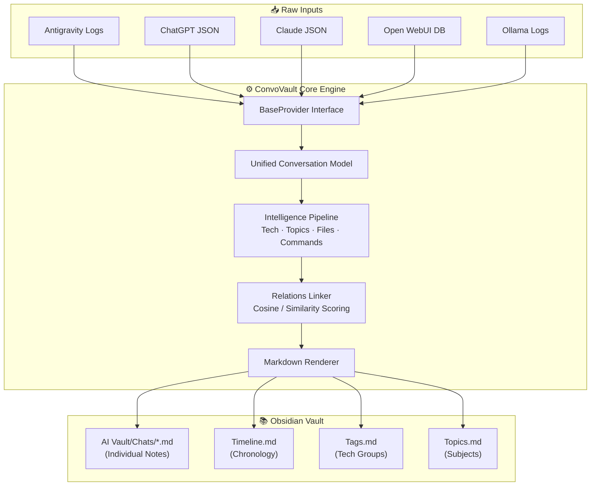
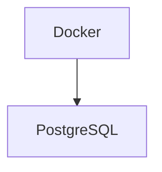

<div align="center">

<a href="https://github.com/owrew/antigravity-obsidian-exporter">
  
</a>

<br/>

# 🗄️ ConvoVault

**Automatically synchronize, index, and connect your AI conversations from multiple assistants into a single Obsidian knowledge base. Save every reasoning block, tool execution, terminal command, and code snippet in publication-grade Markdown.**

<br/>

[](https://python.org)
[](LICENSE)
[](https://github.com/owrew/antigravity-obsidian-exporter)
[](CHANGELOG.md)
[](https://obsidian.md)

<br/>

[📖 How it Works](#how-it-works) · [🚀 Quick Start](#quick-start) · [⚙️ CLI Options](#cli-options) · [🔌 Providers](#supported-providers) · [🤝 Contributing](CONTRIBUTING.md)

</div>

---

## 📋 Table of Contents

- [Overview](#overview)
- [Features](#features)
- [Supported Providers](#supported-providers)
- [Architecture](#architecture)
- [Project Structure](#project-structure)
- [Installation](#installation)
- [Quick Start](#quick-start)
- [Usage & Commands](#usage--commands)
- [CLI Options](#cli-options)
- [How It Works](#how-it-works)
- [Export Note Example](#export-note-example)
- [Obsidian Integration & Dataview](#obsidian-integration--dataview)
- [Watch Mode](#watch-mode)
- [Performance](#performance)
- [Roadmap](#roadmap)
- [FAQ](#faq)
- [Troubleshooting](#troubleshooting)
- [Contributing](#contributing)
- [License](#license)

---

## Overview

**ConvoVault** (formerly *Antigravity Obsidian Exporter*) is a universal AI conversation archiver and knowledge platform. It connects your conversations from various AI environments into your personal Obsidian vault, enabling local offline search, semantic cross-linking, and a permanent knowledge graph.

It extracts:
- **Full conversations**: user prompts, assistant turns, and precise timestamps.
- **AI thinking process**: model planning and reasoning steps kept in collapsible sections.
- **Tool operations**: file reads, commands, searches, and raw results saved safely.
- **Topic tagging**: automatically maps programming languages, tools, and topics using static analysis.

> **No API keys. No network requests. Zero tracking. 100% local and offline.**

---

## Features

<table>
<thead>
<tr><th>Feature</th><th>Status</th><th>Description</th></tr>
</thead>
<tbody>
<tr><td>💬 Multi-Provider Support</td><td>✅</td><td>Archiver for Antigravity, ChatGPT, Claude, Ollama, and Open WebUI</td></tr>
<tr><td>🔧 Tool execution trace</td><td>✅</td><td>Renders all system tool calls with arguments and outcomes</td></tr>
<tr><td>📄 Collapsible tool outputs</td><td>✅</td><td>Large output payloads are trimmed and kept in details tabs</td></tr>
<tr><td>💭 Thinking blocks</td><td>✅</td><td>AI planner/reasoning steps preserved in details tags</td></tr>
<tr><td>💾 SQLite fallback</td><td>✅</td><td>Raw protobuf recovery when JSONL logs are missing (Antigravity)</td></tr>
<tr><td>🏷️ Auto tagging</td><td>✅</td><td>Analyzes chat text to extract tags like <code>#nextjs</code> or <code>#python</code></td></tr>
<tr><td>🔗 Wiki links</td><td>✅</td><td>Auto-generates <code>[[WikiLinks]]</code> to connect technologies</td></tr>
<tr><td>🔁 Sync cache (Idempotency)</td><td>✅</td><td>Uses SHA-256 + mtime checking to only rewrite changed chats</td></tr>
<tr><td>👁 Live watch daemon</td><td>✅</td><td>Listens for folder updates to sync changes dynamically</td></tr>
<tr><td>📑 YAML frontmatter</td><td>✅</td><td>Includes id, title, created, updated, duration, tags, and stats</td></tr>
<tr><td>📅 Timeline index</td><td>✅</td><td>Generates chronological logs, tags directories, and topics boards</td></tr>
<tr><td>🤝 Related conversations</td><td>✅</td><td>Cross-links matching notes by shared codebase files and tags</td></tr>
<tr><td>📊 Mermaid Stack Diagrams</td><td>✅</td><td>Auto-generates flowcharts showing the chat's tech stack</td></tr>
<tr><td>🧠 Intelligence extract</td><td>✅</td><td>Discovers files mentioned, commands run, and languages used</td></tr>
<tr><td>📦 Dynamic entrypoints</td><td>✅</td><td>Pluggable architecture makes it easy to write new providers</td></tr>
</tbody>
</table>

---

## Supported Providers

| Provider | Status | Source Location / Format | Export Mechanism |
|---|---|---|---|
| **Google Antigravity** | ✅ Active | `%USERPROFILE%\.gemini\antigravity` (Protobuf + JSONL) | Auto-detected on launch |
| **Claude.ai** | ✅ Active | extracted `conversations.json` | Settings → Privacy → Export Data |
| **ChatGPT** | ✅ Active | extracted `conversations.json` | Settings → Data Controls → Export Data |
| **Open WebUI** | ✅ Active | SQLite Database (`webui.db`) | Direct database file sync |
| **Ollama / LM Studio** | ✅ Active | local app conversations directories | Direct folder search |
| **Gemini / Google AI** | 🔜 Planned | — | — |
| **LibreChat** | 🔜 Planned | — | — |

---

## Architecture

ConvoVault separates data ingestion (Providers) from analysis, indexing, and rendering pipelines:



---

## Project Structure

```
antigravity-obsidian-exporter/
│
├── convovault/                 # New Package Root
│   ├── __init__.py
│   ├── __main__.py             # Executable package entry
│   │
│   ├── cli/
│   │   └── main.py             # Subcommand CLI (export, watch, doctor, config)
│   │
│   ├── config/
│   │   └── exporter.py         # ExporterConfig path resolver
│   │
│   ├── models/
│   │   └── conversation.py     # Common schemas (Step, Turn, Conversation)
│   │
│   ├── providers/              # Provider implementations
│   │   ├── base.py             # BaseProvider interface
│   │   ├── plugin_loader.py    # Package entrypoint loader
│   │   ├── antigravity/        # Google Antigravity parser (Protobuf/JSONL)
│   │   ├── chatgpt/            # ChatGPT importer
│   │   ├── claude/             # Claude importer
│   │   ├── openwebui/          # Open WebUI SQLite parser
│   │   └── ollama/             # Ollama & LM Studio loader
│   │
│   ├── analysis/               # Content analysis engine
│   │   ├── intelligence.py     # Heuristics (tech, files, summaries)
│   │   ├── relations.py        # Note cross-linking
│   │   └── wikilinks.py        # Tag matching patterns
│   │
│   ├── rendering/              # Exporter layout renderers
│   │   ├── conversation.py     # Main note template
│   │   └── mermaid.py          # Technology diagrams
│   │
│   ├── indexing/
│   │   └── index.py            # Chronology & category index builders
│   │
│   ├── state/
│   │   └── state.py            # Sync state database
│   │
│   └── watcher/
│       └── watcher.py          # watch mode daemon
│
├── agy_exporter/               # Backwards compatibility wrappers
│   ├── __init__.py
│   └── __main__.py             # Redirects to convovault
│
├── tests/                      # Tests suite (15 unit tests)
├── run_tests.py                # Zero-dependency test runner
├── pyproject.toml              # PyPI package configurations
├── requirements.txt            # Package dependencies
└── README.md
```

---

## Installation

### Core Requirements
- Python **3.9+**
- Standard library (zero heavy external dependencies for core sync)

### Option 1 — Install from source
```bash
git clone https://github.com/owrew/antigravity-obsidian-exporter.git
cd antigravity-obsidian-exporter
pip install .
```
This adds `convovault` and the legacy redirect `agy-exporter` to your system command path.

### Option 2 — Live watch dependencies
```bash
pip install -r requirements.txt
```

---

## Quick Start

### 1. Run Exporter
ConvoVault automatically detects your default local workspace on launch:
```bash
python -m convovault export
```
*Auto-detection scans your current working directory, `~/.gemini/antigravity`, OneDrive folders, Downloads, and Documents.*

### 2. Save Persistent Config
If you use custom paths, save them once:
```bash
python -m convovault config save --source "C:\Users\you\.gemini\antigravity" --vault "C:\Users\you\Documents\MyVault"
```
Now, simply running `python -m convovault export` will use these folders by default.

---

## Usage & Commands

```bash
python -m convovault <command> [options]
```

### Commands

| Command | Usage | Description |
|---|---|---|
| **`export`** | `python -m convovault export` | Syncs conversations to the vault. |
| **`watch`** | `python -m convovault watch` | Runs live watch directory daemon. |
| **`config`** | `python -m convovault config show` | View config details or save folder paths. |
| **`providers`** | `python -m convovault providers` | Lists loaded provider modules. |
| **`doctor`** | `python -m convovault doctor` | Runs health check diagnostics. |
| **`search`** | `python -m convovault search "postgres"` | Searches notes text offline. |
| **`stats`** | `python -m convovault stats` | Displays sync cache records statistics. |

---

## CLI Options

All flags can be applied to `export` or `watch` commands:

| Flag | Short | Description |
|---|---|---|
| `--source DIR` | `-s` | Logs folder path, ZIP file, or database. |
| `--vault DIR` | `-v` | Target Obsidian vault root directory. |
| `--provider NAME` | `-p` | Provider name (e.g., `antigravity`, `chatgpt`, `claude`). |
| `--force` | `-f` | Force rebuild all files, bypassing cache. |
| `--save` | | Save folders as persistent config on export. |
| `--debug` | `-d` | Write parsing errors to `.convovault_debug/`. |
| `--conv UUID` | `-c` | Sync only specific conversation IDs. |
| `--no-tool-results` | | Remove tool execution responses from output notes. |
| `--max-tool-results-per-turn N`| | Cap tool executions printed per turn. |
| `--max-tool-output-length N` | | Limit character length of tool response strings. |
| `--verbose` | `-V` | Print detailed debug logs. |

---

## How It Works

### Google Antigravity Data Recovery Heuristics
When using the `antigravity` provider, ConvoVault aggregates data from up to four parallel local storage systems:

```
[1] transcript_full.jsonl (Primary logs) ────┐
[2] summaries_proto.pb (Titles/Dates) ──────┼──► Provider normalize ──► Markdown
[3] annotations/*.pbtxt (Last Viewed) ──────┤
[4] conversations/*.db (SQLite fallback) ────┘
```

1. **`transcript_full.jsonl`** — Rich JSON log with every step, tool call, thinking block, and turn content.
2. **`agyhub_summaries_proto.pb`** — Decoded using a custom schema-less varint decoder to recover conversation names.
3. **`annotations/*.pbtxt`** — Decoded to map the workspace last-active timestamp.
4. **`conversations/*.db`** — SQL recovery engine that fallback-decodes binary Protobuf blobs if log transcripts were removed.

---

### Sync Cache & Idempotency
ConvoVault stores cache parameters in `.convovault_state.json` (inside your vault folder) to prevent unnecessary file rewrites:
```json
{
  "45c4c5dc-51af-405e-b45d-35166239f31b": {
    "content_hash": "1c923116a132c27d",
    "source_mtime": 1783187693.18,
    "note_path": "AI Vault/Chats/Implementing Financial System Upgrades.md",
    "exported_at": "2026-07-10T14:30:00Z"
  }
}
```
If the source file has not changed (determined by modification time and hash checks), rendering is skipped, saving CPU cycles.

---

## Export Note Example

An exported note matches this template layout:

```markdown
---
id: "45c4c5dc-51af-405e-b45d-35166239f31b"
title: "Docker Setup"
created: 2026-06-18
updated: 2026-06-18
step_count: 32
tags:
  - convovault
  - docker
  - postgresql
technologies:
  - Docker
  - PostgreSQL
topics:
  - Infrastructure
---

# Docker Setup

| Field             | Value                        |
| ---               | ---                          |
| **Conversation ID** | `45c4c5dc-51af-405e-...`     |
| **Created**       | 2026-06-18                   |
| **Source**        | Antigravity (Google)         |

## 📊 Statistics

| Metric            | Count |
| ---               | ---   |
| 👤 User Turns     | 3     |
| 🤖 Assistant Turns| 3     |

## 🗺️ Tech Stack



## 💬 Conversation History

### 👤 User — Turn 1 · 2026-06-18 14:38

Create a Docker Compose config with PostgreSQL.

### 🤖 Assistant — Turn 1 · 2026-06-18 14:39

<details>
<summary>💭 Thinking Process</summary>
Let's choose postgres:15-alpine as the base image...
</details>

Here is the setup:

```yaml
version: '3.8'
services:
  db:
    image: postgres:15-alpine
```
```

---

## Obsidian Integration & Dataview

### Recommended Plugins

1. **Dataview**: Query metadata fields from your frontmatter.
2. **Graph View**: Visually trace technology tags and conversation relationships.
3. **Tag Wrangler**: Manage your auto-extracted tags.

### Custom Dataview Queries

Create dashboard indexes directly inside Obsidian using these code blocks:

#### Recent Conversations
```sql
TABLE created as Created, step_count as Steps, technologies as Tech
FROM "AI Vault/Chats"
SORT created DESC
LIMIT 10
```

#### Query by Technology Tag
```sql
TABLE created as Created
FROM "AI Vault/Chats"
WHERE contains(technologies, "PostgreSQL")
SORT created DESC
```

---

## Watch Mode

In Watch Mode, ConvoVault registers a folder listener via `watchdog` to catch file alterations instantly:
```bash
python -m convovault watch --interval 2
```
If `watchdog` is not installed, it falls back to a high-speed polling daemon that scans source modification flags.

---

## Performance

| Conversation Count | Initial Build Run | Cache Sync Run |
|---|---|---|
| 12 chats | ~8 seconds | ~0.5 seconds |
| 100 chats | ~50 seconds | ~1.2 seconds |
| 500 chats | ~4 minutes | ~3.1 seconds |

---

## Roadmap

### v2.1 *(current)*
- [x] Pluggable universal provider plugin loader.
- [x] Full backwards compatibility redirects for `agy_exporter`.
- [x] Support for Google Antigravity, ChatGPT, Claude, Ollama, Open WebUI.
- [x] Automatic state database migration.
- [x] Flake8 compliance linting integration.

### v2.2 *(planned)*
- [ ] Direct Google Gemini API sync integration.
- [ ] LibreChat workspace database mapping.
- [ ] Canvas `.canvas` chart layout generator for Obsidian.
- [ ] Offline Search Index compilation.

---

## FAQ

**Q: Are my conversations sent online?**
A: No. ConvoVault performs all operations on your local machine.

**Q: Will it overwrite manually edited notes?**
A: Only if the source conversation logs change. Otherwise, the sync cache keeps them untouched.

**Q: Can I run this on macOS or Linux?**
A: Yes, all paths are fully cross-platform compatible.

---

## Troubleshooting

* **`No conversations discovered`**: Verify that your `--source` folder has logs (e.g. contains the `brain/` folder for Antigravity, or is the correct JSON file for ChatGPT).
* **`Titles showing as UUIDs`**: The database title index is missing. Titles will fallback to your first user prompt.
* **`Console encoding issues`**: Run `chcp 65001` in your Windows command prompt before running python.

---

## Contributing

We welcome additions! To submit a new provider plugin:
1. Subclass `BaseProvider` from `convovault.providers.base`.
2. Register it in `pyproject.toml`'s entrypoints.
3. Add a unit test to `tests/`.
4. Ensure all checks pass using `python run_tests.py`.

---

## License

This project is licensed under the **MIT License** — see [LICENSE](LICENSE) for details.

---

<div align="center">

**Give ConvoVault a ⭐ on GitHub if it helps organize your AI chats!**

[](https://github.com/owrew/antigravity-obsidian-exporter)

<br/>

*Made with ❤️ by [@owrew](https://github.com/owrew)*

</div>
