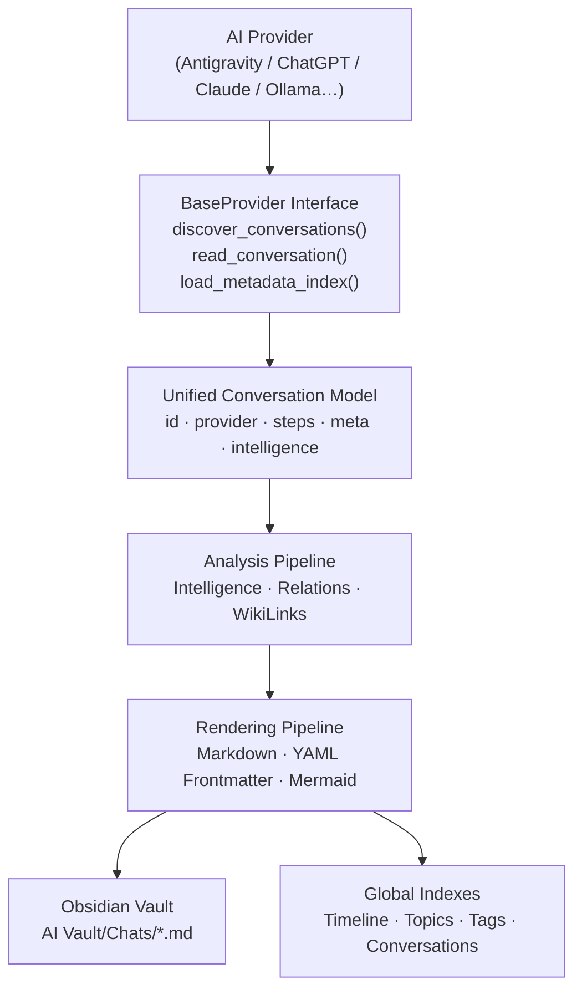

<div align="center">

<svg xmlns="http://www.w3.org/2000/svg" width="700" height="120" viewBox="0 0 700 120">
  <defs>
    <linearGradient id="grad" x1="0%" y1="0%" x2="100%" y2="0%">
      <stop offset="0%" style="stop-color:#7c3aed"/>
      <stop offset="100%" style="stop-color:#2563eb"/>
    </linearGradient>
  </defs>
  <rect width="700" height="120" fill="#0d1117" rx="14"/>
  <text x="350" y="68" font-family="'Segoe UI', system-ui, sans-serif" font-size="44" font-weight="800" fill="url(#grad)" text-anchor="middle" dominant-baseline="middle">🗄️ ConvoVault</text>
  <text x="350" y="100" font-family="'Segoe UI', system-ui, sans-serif" font-size="16" fill="#8b949e" text-anchor="middle" dominant-baseline="middle">The open-source knowledge vault for your AI conversations</text>
</svg>

# ConvoVault

**The open-source knowledge vault for your AI conversations.**

[](https://github.com/owrew/antigravity-obsidian-exporter/actions/workflows/ci.yml)
[](https://python.org)
[](LICENSE)
[](#providers)
[](tests/)

ConvoVault automatically imports, synchronizes, indexes, and connects conversations from **multiple AI assistants** into a single Obsidian knowledge base — preserving metadata, code, tool calls, reasoning blocks, timestamps, and semantic relationships.

</div>

---

## ✨ Features

- 📥 **Universal Import** — One platform for every AI provider
- 🔄 **Incremental Sync** — Only processes what changed (SHA-256 + mtime)
- 🧠 **Intelligence Extraction** — Technologies, topics, files, commands auto-detected
- 🕸️ **Graph Relationships** — Conversations cross-linked by shared content
- 🗺️ **Global Indexes** — Timeline, Tags, Topics, Conversations dashboards
- 💬 **Complete Archive** — Every turn, thinking block, tool call, and output preserved
- 📊 **Mermaid Diagrams** — Tech stack visualized per conversation
- 🔍 **Search** — Full-text search across all exported notes
- 👀 **Watch Mode** — Live sync via `watchdog` or polling fallback
- 🔌 **Plugin System** — Add new providers via Python entry points

---

## 🤖 Providers

| Provider | Status | Data Source |
|---|---|---|
| **Google Antigravity** | ✅ Active | Protobuf + JSONL transcripts |
| **ChatGPT** | ✅ Active | `conversations.json` export |
| **Claude.ai** | ✅ Active | `conversations.json` export |
| **Open WebUI** | ✅ Active | `webui.db` SQLite database |
| **Ollama / LM Studio** | ✅ Active | JSON chat folders |
| **Gemini** | 🔜 Planned | — |
| **LibreChat** | 🔜 Planned | — |

**Future providers:** Cursor, Cline, Continue.dev, Aider, Roo Code, GitHub Copilot, Microsoft Copilot, OpenHands, and community plugins.

---

## 🏗️ Architecture



---

## ⚡ Quick Start

### 1. Clone

```bash
git clone https://github.com/owrew/antigravity-obsidian-exporter.git
cd antigravity-obsidian-exporter
```

### 2. Auto-detect workspace (Antigravity)

The exporter scans common install paths automatically. If your Antigravity workspace is in any of these, no configuration is needed:

- `~/OneDrive/Downloads/OBS` (Windows)
- `~/Downloads/OBS`, `~/Documents/OBS`, `~/Desktop/OBS`
- `~/Library/Application Support/Antigravity` (macOS)
- `~/.antigravity`, `~/.config/antigravity` (Linux)

### 3. Save your paths permanently (run once)

```bash
python -m convovault config save --source "C:\Users\you\OBS" --vault "C:\Users\you\ObsidianVault"
```

### 4. Export

```bash
python -m convovault export
```

Open your vault in Obsidian — notes appear under **AI Vault → Chats**.

---

## 🛠️ CLI Reference

### Subcommands

```
convovault export     Export conversations to Obsidian vault
convovault watch      Live sync — re-exports on file changes
convovault providers  List registered providers
convovault search     Search exported notes
convovault stats      Show sync statistics
convovault doctor     Run environment health diagnostics
convovault config     Manage persistent configuration
convovault version    Show version
```

### `export` flags

| Flag | Short | Description |
|---|---|---|
| `--source DIR` | `-s` | Source folder (auto-detected if omitted) |
| `--vault DIR` | `-v` | Obsidian vault root (defaults to `--source`) |
| `--provider NAME` | `-p` | Provider: `antigravity`, `chatgpt`, `claude`, etc. |
| `--save` | | Persist `--source`/`--vault`/`--provider` to config file |
| `--force` | `-f` | Rebuild all notes ignoring cache |
| `--debug` | `-d` | Write decode errors to `.convovault_debug/` |
| `--conv UUID…` | `-c` | Export specific conversation UUID(s) only |
| `--no-tool-results` | | Omit tool output blocks (shorter notes) |
| `--max-tool-results-per-turn N` | | Cap tool result blocks per turn |
| `--max-tool-output-length N` | | Cap characters per tool output block |
| `--verbose` | `-V` | Enable DEBUG logging |

### `watch` flags

Same as `export` plus `--interval SECS` (default: 5.0).

---

## ⚙️ Configuration

Configuration is resolved in this priority order:

```
1. CLI flags       --source / --vault / --provider
2. Environment     AGY_SOURCE / AGY_VAULT / AGY_PROVIDER
3. Config file     %APPDATA%\convovault\config.json
4. Auto-detect     scans 14 common install paths
```

### Config file (recommended)

```bash
# Save paths once
convovault config save --source PATH --vault PATH --provider antigravity

# Show active configuration
convovault config show
```

The config file is plain JSON you can also edit manually:

```json
{
  "source": "C:\\Users\\you\\OBS",
  "vault":  "C:\\Users\\you\\Documents\\MyVault",
  "provider": "antigravity"
}
```

### Environment variables

```bash
# Linux / macOS
export AGY_SOURCE="$HOME/antigravity"
export AGY_VAULT="$HOME/ObsidianVault"
export AGY_PROVIDER="antigravity"

# Windows PowerShell
$env:AGY_SOURCE = "C:\Users\you\OBS"
$env:AGY_VAULT  = "C:\Users\you\Vault"
```

---

## 🔌 Provider Usage

### Google Antigravity (default)

```bash
convovault export --provider antigravity --source "C:\Users\you\OBS"
```

### ChatGPT

1. Go to **Settings → Data Controls → Export Data**
2. Download the ZIP, extract `conversations.json`
3. Run:

```bash
convovault export --provider chatgpt --source path/to/conversations.json
```

### Claude.ai

1. Go to **Settings → Privacy → Export Data**
2. Download the ZIP, extract `conversations.json`
3. Run:

```bash
convovault export --provider claude --source path/to/conversations.json
```

### Open WebUI

```bash
convovault export --provider openwebui --source path/to/webui.db
```

### Ollama / LM Studio

```bash
# LM Studio (JSON chat files)
convovault export --provider ollama --source "$HOME\AppData\Roaming\LM Studio\conversations"
```

---

## 📁 Vault Output Structure

```
ObsidianVault/
│
├── AI Vault/
│   └── Chats/
│       ├── Fixing EAS CLI Setup.md
│       ├── Implementing Financial System.md
│       └── ...
│
├── Timeline.md       ← Chronological event log
├── Conversations.md  ← Full metadata table
├── Tags.md           ← Grouped by technology tags
└── Topics.md         ← Grouped by topic domains
```

### Note structure

Each exported note contains:

- **YAML frontmatter** — id, provider, title, date, duration, technologies, topics, code languages
- **Conversation Statistics** — turn counts, tool call breakdown
- **Tech Graph** — Mermaid flowchart of detected technologies
- **Wiki Links** — `[[Technology]]` links for Obsidian Graph
- **Related Conversations** — cross-linked by shared files, tech, topics
- **Complete Conversation History** — every turn in order, with:
  - Timestamps on every turn
  - Collapsible thinking blocks
  - Tool call arguments and full outputs
  - Terminal output, file contents, search results
- **Files Mentioned & Commands Executed** sections
- **Conversation Intelligence** summary

---

## 🧩 Plugin System

Add a new provider by implementing `BaseProvider`:

```python
from convovault.providers.base import BaseProvider
from convovault.models import Conversation, ConversationMeta
from convovault.config.exporter import ExporterConfig
from typing import List, Dict, Optional

class MyProvider(BaseProvider):
    @property
    def name(self) -> str:
        return "myprovider"

    def discover_conversations(self, config: ExporterConfig) -> List[str]:
        # Return list of conversation IDs
        return []

    def read_conversation(self, conv_id: str, config: ExporterConfig) -> Optional[Conversation]:
        # Read and normalize conversation data
        return None

    def load_metadata_index(self, config: ExporterConfig) -> Dict[str, ConversationMeta]:
        # Return metadata index (title, timestamps)
        return {}
```

Register via Python entry points in `pyproject.toml`:

```toml
[project.entry-points."convovault.providers"]
myprovider = "my_package.provider:MyProvider"
```

Or register programmatically:

```python
from convovault.providers import register_provider
register_provider("myprovider", MyProvider)
```

---

## 🗺️ Roadmap

### v2.1 (Current)
- [x] Multi-provider architecture (Antigravity, ChatGPT, Claude, Ollama, Open WebUI)
- [x] Archive-quality note rendering
- [x] 4-level config system with auto-detection
- [x] Plugin system with entry points
- [x] Subcommand CLI

### v2.2 (Planned)
- [ ] HTML export
- [ ] Full-text search index
- [ ] Canvas generation (Obsidian Canvas)
- [ ] Gemini provider
- [ ] LibreChat provider
- [ ] Cursor / Cline providers

### v3.0 (Future)
- [ ] Semantic embeddings + local vector search
- [ ] RAG indexing
- [ ] AI-generated summaries
- [ ] MCP server integration
- [ ] PDF export
- [ ] Web UI

---

## 🛟 Troubleshooting

**Run the doctor:**
```bash
convovault doctor
```

**Nothing is being exported:**
```bash
convovault config show    # Verify paths resolve correctly
```

**Vault is stale / notes not updating:**
```bash
convovault export --force    # Force full rebuild
```

**Provider not found:**
```bash
convovault providers    # List all registered providers
```

---

## 🤝 Contributing

Contributions are very welcome! See [CONTRIBUTING.md](CONTRIBUTING.md) for guidelines.

The fastest way to contribute is to implement a new provider — see [Plugin System](#-plugin-system) above.

---

## 🔒 Security

Please read [SECURITY.md](SECURITY.md) before reporting vulnerabilities.

---

## 📜 License

MIT — see [LICENSE](LICENSE).

---

## 👤 Author

**AWAIS ALI RAFAQAT HUSSAIN** — [@owrew](https://github.com/owrew)

> *"Your AI conversations are valuable knowledge. ConvoVault makes sure you never lose them."*

---

<div align="center">

**[⭐ Star on GitHub](https://github.com/owrew/antigravity-obsidian-exporter)** · **[🐛 Report a Bug](https://github.com/owrew/antigravity-obsidian-exporter/issues/new?template=bug_report.md)** · **[💡 Request a Feature](https://github.com/owrew/antigravity-obsidian-exporter/issues/new?template=feature_request.md)**

</div>
